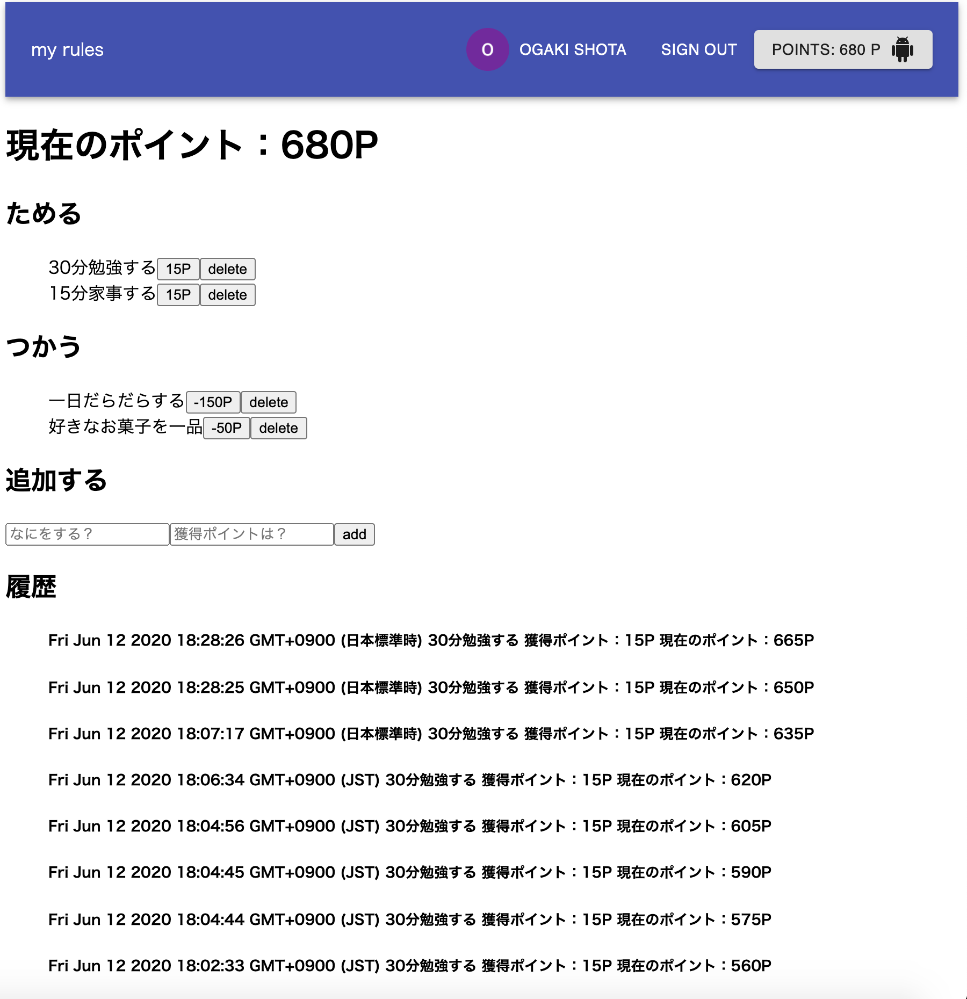

# my-rules-react 
概要：reactを使用した目標達成、習慣化を目的としたアプリケーションです。 
自分でルール、ポイント数を設定しポイントを稼ぎ、獲得したポイントは自身のご褒美に使用します 
ポイントを貯める方法や消費方法を設定、削除出来ます。 
過去のポイント履歴も確認出来ます。 
また、データが永続化されるため、いつでも確認可能です。 
 

# 機能一覧： 
・googleログイン機能（firebase） 
・リアルタイムアップデート（firebase onSnapshot()メソッド） 
・データの永続化（firebase firestore） 
・ポイント獲得方法の削除と追加（firebase firestore） 
・ポイント使用方法の削除と追加（firebase firestore） 
・ポイント使用履歴、現在のポイント数の表示（firebase firestore） 

# ソフトウェア構成 
    react: 16.13.1, 
    react-dom: 16.13.1, 
    react-router-dom: 5.2.0 
    react-scripts: 3.4.1 
    @material-ui/core: 4.10.1, 
    @material-ui/icons: 4.9.1, 
    @testing-library/jest-dom: 4.2.4, 
    @testing-library/react: 9.5.0, 
    @testing-library/user-event: 7.2.1, 
    dotenv: 8.2.0, 
    firebase: 7.15.0, 
    flow-bin: 0.125.1
